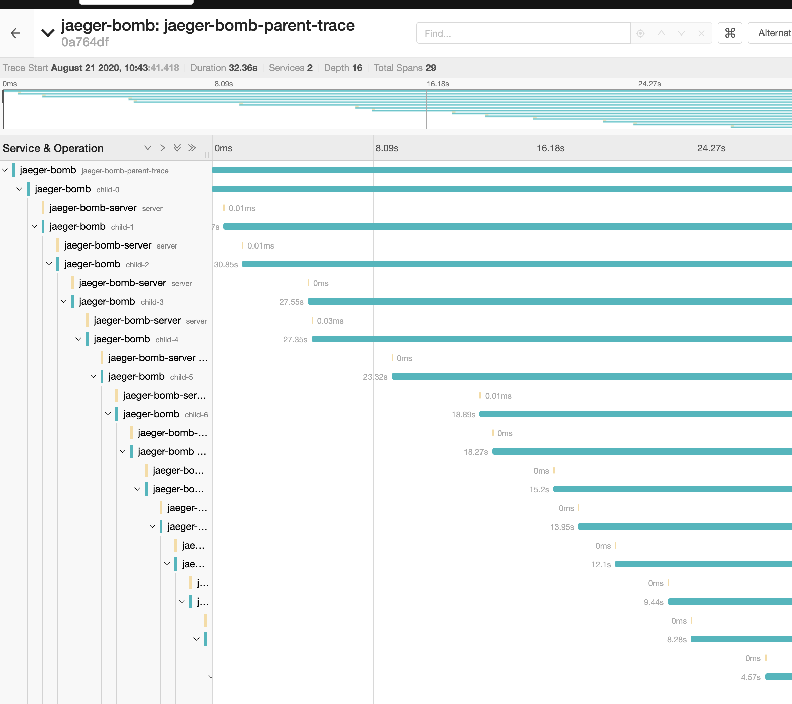

# go-jaeger

A simple app to create Jaeger spans with [jaeger-client-go](https://github.com/jaegertracing/jaeger-client-go)

This app will create a nest of spans every few seconds - it is useful for testing your entire Jaeger setup.


### How it works

Guts of the code... spits out a bunch of spans over and over.

 
```go

	lastParent := span.Context()
	for i :=0; i < childCount; i++ {
		// Create a Child Span. Note that we're using the ChildOf option. 
		childSpan := tracer.StartSpan(
			fmt.Sprintf("child-%d",i),
			opentracing.ChildOf(lastParent),
		)
		sleepTime := rand.Intn(5000)
		// Delay in the child spans
		time.Sleep(time.Duration(sleepTime) * time.Millisecond)

		defer childSpan.Finish()
		lastParent = childSpan.Context()
	}
	jLogger.Infof("Generated %d child spans",childCount)
}
```

## How to use this repository

- This repository contains the golang code for creating the spans, the Dockerfile and the helm chart to get it into kubernetes.
- You may find you want to tweak the helm configuration to get it to work for your infrastructure.

### Set this example up in an existing cluster

```
cd helm
helm install jaeger-bomb . --set=jaeger.agent.connectionstring="mycollector.svc:9999"
```

### Setup the toy example locally

- `make up`
- `make jaeger-install`
- `make jaeger-bomb-install`

_At this point you'll have a KIND cluster with a tracing namespace full of Jaeger components. Our helm chart jaeger-bomb will be sending spans from the
default namespace into the jaeger-collector in the tracing namespace_




